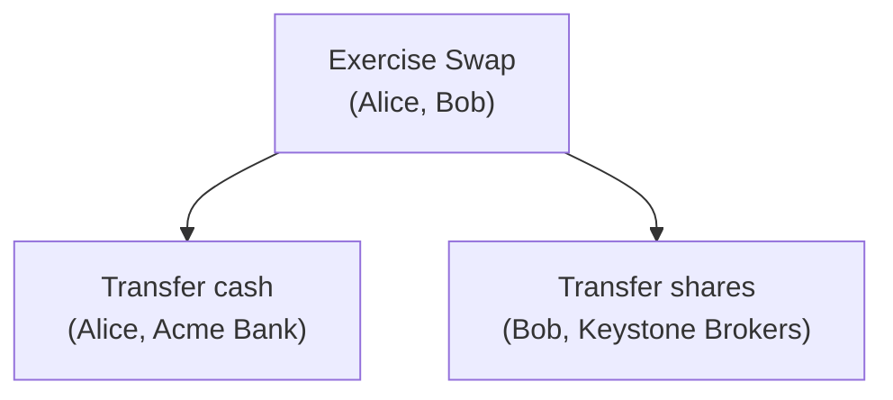

The previous page mentioned that Canton is private by default. This page explains how that works in practice: how a single transaction can involve multiple parties across different organizations, yet each participant only sees the parts that involve its own parties.

## Transaction trees

When you exercise a choice on a contract, the result is not a single flat operation. It is a **transaction tree**: a hierarchy of actions where each action can trigger further sub-actions.

Consider the share trade from the previous page. Alice exercises a "Swap" choice on a trade contract that exchanges her cash for Bob's shares. This single choice triggers two sub-actions:

The entire tree is **atomic**: it either fully succeeds or fully fails. There is no state where Alice's cash has moved but Bob's shares have not.

## Views: what each participant sees

Canton does not simply hide entire transactions from uninvolved parties. It operates at a finer level: each participant only receives the **views** (branches of the tree) that involve its own parties. Everything else is invisible.

Using the trade example:

| Participant | What it sees |
|---|---|
| Alice's participant | The Swap and the cash transfer |
| Bob's participant | The Swap and the share transfer |
| Acme Bank's participant | Only the cash transfer |
| Keystone Brokers' participant | Only the share transfer |

Acme Bank never learns about the share transfer, and Keystone Brokers never learns about the cash transfer. Each party sees exactly what it needs to validate its part of the transaction, and nothing more.

## How this is enforced

Sub-transaction privacy is not an access control layer on top of the data. It is built into the protocol itself:

1. The submitting participant encrypts each view separately, using only the keys of the participants that need to see it.
2. The synchronizer delivers the encrypted views to the relevant participants. It cannot read them.
3. Each participant decrypts only the views intended for it, validates them, and responds.

No participant ever receives data it should not see. There is no central store where all views exist in the clear, and no configuration to get wrong. The encryption boundaries are determined by Daml visibility rules (informees, including stakeholders and controllers).

## Why this matters

In most distributed ledger systems, privacy is either all-or-nothing: either every node sees every transaction, or you silo data into separate channels that cannot transact atomically.

Canton avoids this trade-off. A single atomic transaction can span multiple organizations, and each one only sees its own slice. This means you can build workflows where a bank, a broker, and an insurer all participate in the same settlement, without any of them learning more than they need to.

## Next step

Now that you understand how privacy works at the transaction level, the next page introduces the synchronizer components (sequencers and mediators) that make all of this possible.
