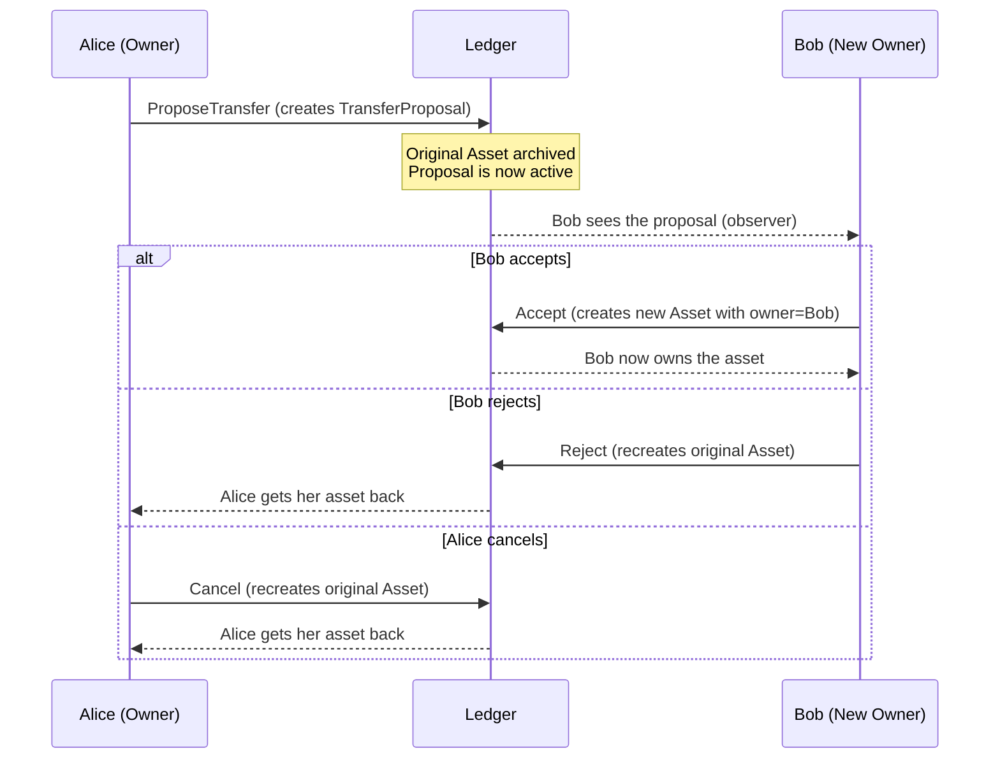
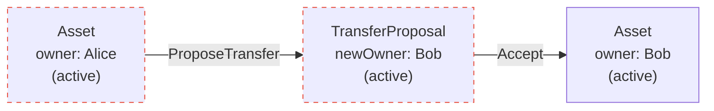

The previous page explained that creating a contract requires the authority of all its signatories. But in practice, one party initiates an action and the other party needs a chance to agree or disagree. You cannot always get both parties to submit at the same time.

This page introduces the **propose-accept pattern**, the standard way to coordinate multi-party authorization in Daml. You will then apply it to model a complete **asset transfer** workflow.

## The problem

Consider an `Asset` template where both `issuer` and `owner` are signatories:

```daml
template Asset
  with
    issuer : Party
    owner : Party
    description : Text
    quantity : Decimal
  where
    ensure quantity > 0.0
    signatory issuer, owner
```

Now Alice (the current owner) wants to transfer her asset to Bob. The new asset would need both `issuer` and `Bob` as signatories. But Alice cannot unilaterally create a contract that binds Bob as a signatory. Bob has not consented.

You need a two-step process: Alice proposes, Bob decides.

## The propose-accept pattern

The pattern splits a multi-signatory operation into two transactions:

1. **Propose.** The initiating party creates a **proposal contract**. This contract has fewer signatories (just the initiator's side) and lists the accepting party as an observer and controller.
2. **Accept.** The accepting party exercises a choice on the proposal, which archives the proposal and creates the real contract with all required signatories.



## Building the asset transfer

### The Asset template

Start with the asset itself. Both issuer and owner are signatories: the issuer vouches for the asset's legitimacy, and the owner consents to holding it.

```daml
template Asset
  with
    issuer : Party
    owner : Party
    description : Text
    quantity : Decimal
  where
    ensure quantity > 0.0

    signatory issuer, owner
```

### The ProposeTransfer choice

The owner can propose transferring the asset to a new party. This is a consuming choice: it archives the original asset and creates a `TransferProposal` in its place.

```daml
    choice ProposeTransfer : ContractId TransferProposal
      with
        newOwner : Party
      controller owner
      do
        create TransferProposal
          with
            asset = this
            newOwner
```

Why consuming? Because the asset should not be "live" while a transfer is pending. If the asset remained active, the owner could propose transfers to multiple people simultaneously, which would be like spending the same asset twice. The UTXO model (from the [previous page](/docs/daml/contract-model)) prevents this naturally: once consumed, the asset cannot be used again.

### The TransferProposal template

The proposal carries the original asset data and the intended new owner:

```daml
template TransferProposal
  with
    asset : Asset
    newOwner : Party
  where
    signatory (signatory asset)
    observer newOwner
```

Notice `signatory (signatory asset)`. This inherits the signatories from the original asset (both issuer and owner). The `newOwner` is an observer, which gives them visibility to see and act on the proposal.

The proposal offers three choices:

**Accept:** The new owner agrees to the transfer. A new `Asset` is created with the updated owner.

```daml
    choice Accept : ContractId Asset
      controller newOwner
      do
        create asset with owner = newOwner
```

Only the `newOwner` is a controller on `Accept`. This is the canonical propose-accept pattern: one party proposes, the other decides. The new owner's authority (as controller) combines with the signatories' authority (from the proposal contract) to authorize creating the new `Asset`.

In more advanced designs, you might also require the issuer to approve transfers (for example, for regulatory reasons). The official Daml tutorials cover this with role contracts and pre-approval mechanisms. For now, the simple pattern is enough.

**Reject:** The new owner declines. The original asset is recreated, returning it to the original owner.

```daml
    choice Reject : ContractId Asset
      controller newOwner
      do
        create asset
```

**Cancel:** The original owner changes their mind. The original asset is recreated.

```daml
    choice Cancel : ContractId Asset
      controller asset.owner
      do
        create asset
```

Both `Reject` and `Cancel` use `create asset` to recreate the original asset, restoring the state to what it was before the proposal.

## How the transfer connects to the UTXO model

The entire transfer is a chain of consume-and-recreate steps:



1. The original `Asset` (owner: Alice) is archived when `ProposeTransfer` is exercised.
2. The `TransferProposal` is created.
3. When Bob exercises `Accept`, the `TransferProposal` is archived.
4. A new `Asset` (owner: Bob) is created.

At every step, there is exactly one active contract representing this asset. No double-spending is possible.

## Testing the workflow

### Successful transfer

```daml
testTransfer : Script ()
testTransfer = script do
  bank <- allocateParty "Bank"
  alice <- allocateParty "Alice"
  bob <- allocateParty "Bob"

  -- Bank issues an asset to Alice (both are signatories).
  -- actAs lets multiple parties authorize in tests. In production,
  -- this would use a propose-accept flow for the initial issuance too.
  assetCid <- submit (actAs [bank, alice]) do
    createCmd Asset
      with
        issuer = bank
        owner = alice
        description = "Gold token"
        quantity = 10.0

  -- Alice proposes transferring the asset to Bob
  proposalCid <- submit alice do
    exerciseCmd assetCid ProposeTransfer
      with newOwner = bob

  -- The original asset is now archived
  aliceAssets <- query @Asset alice
  assertEq 0 (length aliceAssets)

  -- Bob can see the proposal (he is an observer)
  bobProposals <- query @TransferProposal bob
  assertEq 1 (length bobProposals)

  -- Bob accepts the transfer
  newAssetCid <- submit bob do
    exerciseCmd proposalCid Accept

  -- Bob now owns the asset
  bobAssets <- query @Asset bob
  assertEq 1 (length bobAssets)
  let (_, bobAsset) = head bobAssets
  assertEq bob bobAsset.owner
  assertEq 10.0 bobAsset.quantity

  -- Alice no longer has it
  aliceAssets2 <- query @Asset alice
  assertEq 0 (length aliceAssets2)
```

### Rejected transfer

```daml
testReject : Script ()
testReject = script do
  bank <- allocateParty "Bank"
  alice <- allocateParty "Alice"
  bob <- allocateParty "Bob"

  assetCid <- submit (actAs [bank, alice]) do
    createCmd Asset
      with
        issuer = bank
        owner = alice
        description = "Silver token"
        quantity = 5.0

  proposalCid <- submit alice do
    exerciseCmd assetCid ProposeTransfer
      with newOwner = bob

  -- Bob rejects the transfer
  returnedCid <- submit bob do
    exerciseCmd proposalCid Reject

  -- Alice has her asset back
  aliceAssets <- query @Asset alice
  assertEq 1 (length aliceAssets)

  -- Bob has nothing
  bobAssets <- query @Asset bob
  assertEq 0 (length bobAssets)
```

### Unauthorized accept

```daml
testUnauthorizedAccept : Script ()
testUnauthorizedAccept = script do
  bank <- allocateParty "Bank"
  alice <- allocateParty "Alice"
  bob <- allocateParty "Bob"
  charlie <- allocateParty "Charlie"

  assetCid <- submit (actAs [bank, alice]) do
    createCmd Asset
      with
        issuer = bank
        owner = alice
        description = "Gold token"
        quantity = 10.0

  proposalCid <- submit alice do
    exerciseCmd assetCid ProposeTransfer
      with newOwner = bob

  -- Charlie cannot accept Bob's proposal
  submitMustFail charlie do
    exerciseCmd proposalCid Accept

  -- Alice cannot accept her own proposal
  submitMustFail alice do
    exerciseCmd proposalCid Accept
```

## Full code

Here is the complete `daml/Main.daml` for the asset transfer example:

```daml
module Main where

import DA.Assert
import DA.List (head)
import Daml.Script

template Asset
  with
    issuer : Party
    owner : Party
    description : Text
    quantity : Decimal
  where
    ensure quantity > 0.0

    signatory issuer, owner

    choice ProposeTransfer : ContractId TransferProposal
      with
        newOwner : Party
      controller owner
      do
        create TransferProposal
          with
            asset = this
            newOwner

template TransferProposal
  with
    asset : Asset
    newOwner : Party
  where
    signatory (signatory asset)
    observer newOwner

    choice Accept : ContractId Asset
      controller newOwner
      do
        create asset with owner = newOwner

    choice Reject : ContractId Asset
      controller newOwner
      do
        create asset

    choice Cancel : ContractId Asset
      controller asset.owner
      do
        create asset

testTransfer : Script ()
testTransfer = script do
  bank <- allocateParty "Bank"
  alice <- allocateParty "Alice"
  bob <- allocateParty "Bob"

  assetCid <- submit (actAs [bank, alice]) do
    createCmd Asset
      with
        issuer = bank
        owner = alice
        description = "Gold token"
        quantity = 10.0

  proposalCid <- submit alice do
    exerciseCmd assetCid ProposeTransfer
      with newOwner = bob

  aliceAssets <- query @Asset alice
  assertEq 0 (length aliceAssets)

  bobProposals <- query @TransferProposal bob
  assertEq 1 (length bobProposals)

  newAssetCid <- submit bob do
    exerciseCmd proposalCid Accept

  bobAssets <- query @Asset bob
  assertEq 1 (length bobAssets)
  let (_, bobAsset) = head bobAssets
  assertEq bob bobAsset.owner
  assertEq bank bobAsset.issuer
  assertEq 10.0 bobAsset.quantity

  aliceAssets2 <- query @Asset alice
  assertEq 0 (length aliceAssets2)

testReject : Script ()
testReject = script do
  bank <- allocateParty "Bank"
  alice <- allocateParty "Alice"
  bob <- allocateParty "Bob"

  assetCid <- submit (actAs [bank, alice]) do
    createCmd Asset
      with
        issuer = bank
        owner = alice
        description = "Silver token"
        quantity = 5.0

  proposalCid <- submit alice do
    exerciseCmd assetCid ProposeTransfer
      with newOwner = bob

  returnedCid <- submit bob do
    exerciseCmd proposalCid Reject

  aliceAssets <- query @Asset alice
  assertEq 1 (length aliceAssets)

  bobAssets <- query @Asset bob
  assertEq 0 (length bobAssets)

testCancel : Script ()
testCancel = script do
  bank <- allocateParty "Bank"
  alice <- allocateParty "Alice"
  bob <- allocateParty "Bob"

  assetCid <- submit (actAs [bank, alice]) do
    createCmd Asset
      with
        issuer = bank
        owner = alice
        description = "Bronze token"
        quantity = 3.0

  proposalCid <- submit alice do
    exerciseCmd assetCid ProposeTransfer
      with newOwner = bob

  returnedCid <- submit alice do
    exerciseCmd proposalCid Cancel

  aliceAssets <- query @Asset alice
  assertEq 1 (length aliceAssets)

testUnauthorizedAccept : Script ()
testUnauthorizedAccept = script do
  bank <- allocateParty "Bank"
  alice <- allocateParty "Alice"
  bob <- allocateParty "Bob"
  charlie <- allocateParty "Charlie"

  assetCid <- submit (actAs [bank, alice]) do
    createCmd Asset
      with
        issuer = bank
        owner = alice
        description = "Gold token"
        quantity = 10.0

  proposalCid <- submit alice do
    exerciseCmd assetCid ProposeTransfer
      with newOwner = bob

  submitMustFail charlie do
    exerciseCmd proposalCid Accept

  submitMustFail alice do
    exerciseCmd proposalCid Accept

testTransferPreservesData : Script ()
testTransferPreservesData = script do
  bank <- allocateParty "Bank"
  alice <- allocateParty "Alice"
  bob <- allocateParty "Bob"

  assetCid <- submit (actAs [bank, alice]) do
    createCmd Asset
      with
        issuer = bank
        owner = alice
        description = "Gold token"
        quantity = 10.0

  proposalCid <- submit alice do
    exerciseCmd assetCid ProposeTransfer
      with newOwner = bob

  newAssetCid <- submit bob do
    exerciseCmd proposalCid Accept

  bobAssets <- query @Asset bob
  let (_, asset) = head bobAssets
  assertEq bank asset.issuer
  assertEq bob asset.owner
  assertEq "Gold token" asset.description
  assertEq 10.0 asset.quantity
```

## Key takeaways

- **Propose-accept** splits a multi-signatory operation into two steps: one party proposes, the other accepts.
- The **proposal contract** has fewer signatories than the final contract, making it possible for one party to initiate.
- The **accepting party** is listed as an observer on the proposal so they can see it and exercise their choice.
- **Asset transfer** is a natural application: archive the old asset, create a proposal, then accept to create a new asset with the new owner.
- The **UTXO model** prevents double-spending: the original asset is consumed when the proposal is created, so it cannot be transferred twice.
- **Reject** and **Cancel** choices provide clean exits that restore the original state.

<Cards>
  <Card title="Canton Network overview" href="/docs/canton-network" description="Learn how the network enforces these rules across independent organizations." />
</Cards>
