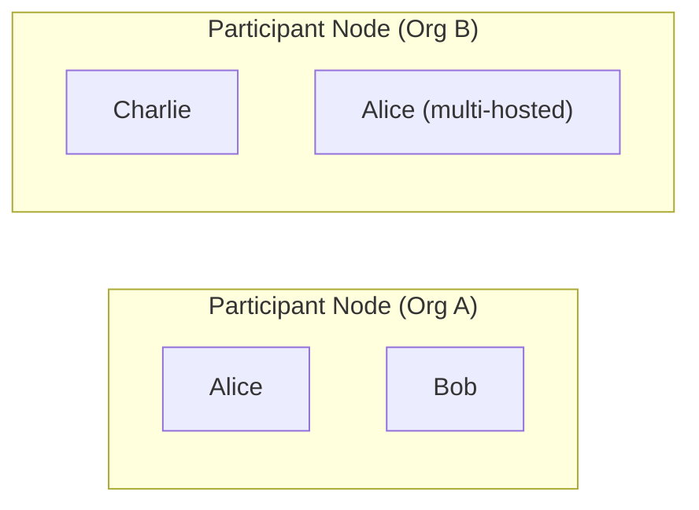
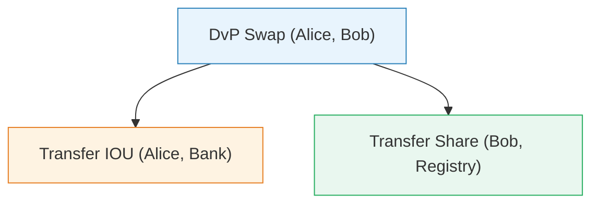

This page introduces the foundational ideas behind Canton. If you have already worked through the [Daml section](/daml), you have seen parties, signatories, and choices from the smart contract perspective. This page explains how those same ideas work at the network level, where multiple organizations are involved.

## Parties and participants

A **party** is a real-world actor: a person, a company, an institution. In Canton, parties do not interact with the network directly. Instead, each party is hosted on a **participant node** operated by an organization.

One participant can host many parties, and one party can be hosted on multiple participants (this is called multi-hosting). For example, a large bank might host thousands of customer parties on a single participant node.

In this example, Alice is hosted on both participants. This lets Alice interact with the network through either organization's infrastructure.

## Contracts and the active contract set

A **contract** is a piece of shared state between parties. It records facts ("Alice owes Bob $100") and defines rules for how those facts can change ("only Alice can trigger payment").

At any given time, each participant maintains an **active contract set (ACS)**: the collection of contracts that are currently live for the parties it hosts. Think of it like a set of unspent outputs, if you are familiar with UTXO-based systems, or like the current rows in a database table.

When a contract is created, it enters the ACS. When it is archived (consumed by a choice), it leaves the ACS. Contracts are never modified in place. Instead, you archive the old contract and create a new one with updated data.

## Transactions

A **transaction** is an atomic operation that creates and archives contracts. "Atomic" means it either fully succeeds or fully fails. There is no in-between state where some contracts are created but others are not.

Transactions are structured as trees. A top-level action (like exercising a choice) can trigger sub-actions (archiving one contract, creating another). The entire tree is committed or rejected as a unit.

### A simple example

Suppose Alice wants to pay Bob, settling a `PaymentObligation` contract:

1. Alice exercises the `Pay` choice on the obligation contract.
2. The choice body archives the obligation.
3. If the transaction is confirmed by all required parties, the obligation leaves the ACS.

From the outside, this looks like a single event: "Alice paid Bob." Inside, it is a tree of actions that the protocol validates step by step.

## Privacy: who sees what

Canton enforces privacy at the transaction level. When a transaction is processed, each participant only sees the parts (called **views**) that involve its own parties. Everything else is invisible.

Consider a delivery-versus-payment (DvP) scenario where Alice trades an IOU from a Bank for shares registered at a Share Registry:

| Participant | What it sees |
|---|---|
| Alice's participant | The DvP swap and the IOU transfer |
| Bob's participant | The DvP swap and the share transfer |
| Bank's participant | Only the IOU transfer |
| Registry's participant | Only the share transfer |

The Bank never learns about the share transfer, and the Registry never learns about the IOU. Each party sees exactly what it needs to see, and nothing more. This is called **sub-transaction privacy**, and it is enforced by the protocol, not by application code.

## Stakeholders and authorization

Every contract has **stakeholders**: the parties who have a stake in the contract's existence. At minimum, the signatories are stakeholders. Observers (parties who can see the contract but did not sign it) are also stakeholders.

For a transaction to be valid, it must be **authorized** by the right parties:

- Creating a contract requires authorization from all signatories.
- Exercising a choice requires authorization from the controller.
- Archiving a contract (through a choice) is authorized by the controller of that choice.

The protocol enforces these rules across organizational boundaries. A participant cannot forge authorization on behalf of a party it does not host.

## Finality

Once a transaction is committed in Canton, it is final. There is no rollback, no chain reorganization, and no waiting for additional confirmations. When all required participants confirm a transaction, the result is permanent.

This is different from many blockchain systems where you must wait for several blocks before considering a transaction "safe." In Canton, a confirmed transaction is immediately and irrevocably part of the ledger.

## Next step

Now that you understand parties, contracts, transactions, and privacy, the next page explains the protocol that makes all of this work: how messages flow between participants and synchronizers to achieve consensus.
