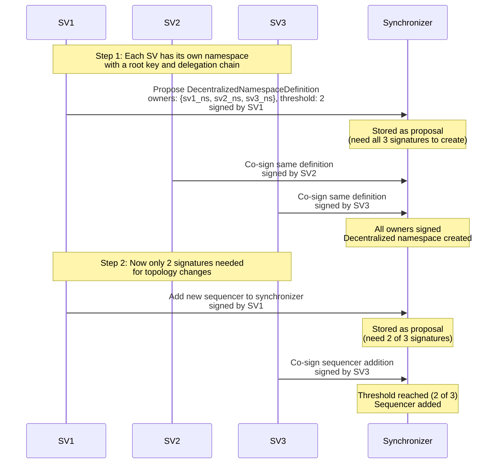

The [topology management](/canton-network/topology-management) page showed how every namespace has a root key controlled by a single organization. Acme Bank owns `acme_ns`, Keystone Brokers owns `keystone_ns`, and each can manage its namespace independently.

But some namespaces should not be controlled by a single organization. The Global Synchronizer, for example, is operated by multiple Super Validators. If one organization held the root key, it could unilaterally add or remove sequencers, change synchronizer parameters, or revoke other members. That would undermine the entire decentralization model.

Canton solves this with **decentralized namespaces**: a namespace jointly owned by multiple organizations, where changes require agreement from a quorum of owners.

## How it works

A decentralized namespace is created through a `DecentralizedNamespaceDefinition` topology transaction. It has three fields:

| Field | Purpose |
|---|---|
| **Namespace** | A unique identifier derived from the set of owners (not from any single key). |
| **Threshold** | The minimum number of owner signatures required to authorize changes. |
| **Owners** | The set of namespaces that jointly control this namespace. |

The namespace itself is computed deterministically: Canton takes the fingerprints of all owner namespaces, sorts them, and hashes the result. This means the same set of owners always produces the same namespace, and no single owner's key is the "root."

### Creating the namespace

To create a decentralized namespace, **all** owners must sign the initial `DecentralizedNamespaceDefinition`. This is stricter than the threshold, because the founding agreement must be unanimous.

### Authorizing subsequent changes

Once the namespace exists, topology transactions within it (adding a sequencer, registering a mediator, changing parameters) require only the **threshold** number of owner signatures. This is where Canton's [proposal workflow](/canton-network/topology-management#proposals-and-multi-signature-authorization) comes in: one owner submits a proposal, others co-sign, and once the threshold is reached, the change takes effect.

### Updating ownership

Owners can be added or removed by submitting a new `DecentralizedNamespaceDefinition` with an updated owner set. The authorization rule for updates is:

- A **threshold** of existing owners must sign (to approve the change).
- **All newly added owners** must also sign (to consent to joining).

The namespace identifier does not change when owners are added or removed after initial creation.

## Relationship with namespace delegation

Decentralized namespaces and namespace delegations are complementary but mutually exclusive on the same namespace:

- A namespace is **either** controlled by a single root key (via `NamespaceDelegation` chains) **or** jointly owned (via `DecentralizedNamespaceDefinition`). Never both.
- Each **owner** of a decentralized namespace must have its own regular namespace with a root certificate. Owners maintain their own `NamespaceDelegation` chains independently.
- Decentralized namespaces **cannot be nested**: an owner must be a regular namespace, not another decentralized namespace.

Think of it this way: `NamespaceDelegation` handles "who can sign on behalf of one organization," while `DecentralizedNamespaceDefinition` handles "which organizations must agree to govern a shared resource."

## Example: Super Validators forming a shared namespace

Three Super Validators (SV1, SV2, SV3) want to jointly operate the Global Synchronizer with a threshold of 2 (any two out of three must agree).

Each Super Validator still manages its own participant, keys, and parties through its own namespace. The decentralized namespace only governs the shared synchronizer infrastructure.

## When to use which

| Scenario | Namespace type |
|---|---|
| A single organization managing its own participant, parties, and keys. | Regular namespace with `NamespaceDelegation` chain. |
| Multiple organizations jointly operating a synchronizer. | Decentralized namespace with `DecentralizedNamespaceDefinition`. |
| A consortium of validators governing shared infrastructure. | Decentralized namespace with an appropriate threshold. |
