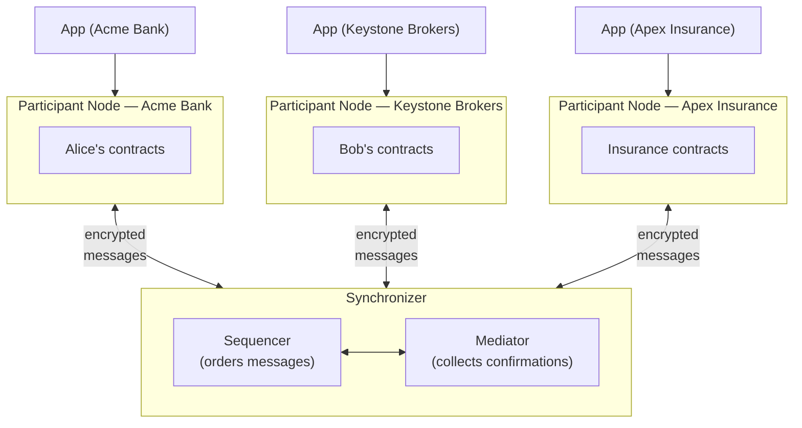

Canton is a network where independent organizations can run shared workflows on a common ledger, without trusting a single central operator. Each organization runs its own node, keeps its own data private by default, and transacts with other organizations using smart contracts written in Daml.

## The building blocks

A Canton network is made up of three kinds of components:

- **Participant nodes** run Daml smart contracts on behalf of parties (people, companies, or institutions). Each organization operates its own participant node and connects to the network through it. Applications connect to participant nodes through an API, just like a web app connects to a database.

- **Synchronizers** coordinate transactions between participant nodes. A synchronizer does not execute business logic or store contract data. It only ensures that all participants agree on the order and outcome of transactions. Synchronizers are made up of [sequencers and mediators](/canton-network/synchronizers).

- **Parties** represent the real-world actors (Alice, Bob, a bank, a registry) whose rights and obligations are encoded in Daml contracts. Parties are hosted on participant nodes.

## A concrete example

Imagine Alice wants to buy shares from Bob and pay for them using funds held at her bank. This single trade touches three independent organizations:

- **Acme Bank** (a retail bank) holds Alice's cash. It needs to confirm that Alice has the funds and authorize the payment.
- **Keystone Brokers** (a brokerage firm) holds Bob's shares. It needs to confirm that Bob owns the shares and transfer them.
- **Apex Insurance** (an insurance company) underwrites settlement risk. It needs to see that the trade settled correctly.

None of these organizations share a database, yet they all need to agree on the outcome. Each runs its own participant node on the Canton network:

Applications talk to their organization's participant node. Each participant stores only its own parties' contracts. The synchronizer coordinates between participants using encrypted messages, so it never sees the actual contract data.

## Privacy by default

In most blockchain systems, every node sees every transaction. Canton takes the opposite approach: a participant only sees the parts of a transaction that involve its own parties. If Alice and Bob trade, Apex Insurance only learns about the parts that affect its own contracts.

This is not an add-on. Privacy is built into the protocol itself. The synchronizer delivers encrypted messages, and only the intended recipients can decrypt them.

## No single point of control

There is no master node, no central database, and no single organization that can unilaterally change the rules. The synchronizer coordinates, but it does not control. Participant nodes independently validate every transaction against the same deterministic rules, so they always reach the same conclusion.

This design means that organizations can participate in shared workflows without handing control to a third party.

## How the pieces connect

When Alice (on Participant Node A) wants to transact with Bob (on Participant Node B):

1. Alice's participant submits a transaction request through the synchronizer.
2. The synchronizer orders the request and delivers it to the relevant participants.
3. Each participant independently validates the transaction using the Daml contract logic.
4. If all required parties confirm, the transaction is committed. Otherwise, it is rejected.

No single participant can force a transaction through. The rules encoded in the Daml contract determine what is allowed, and the protocol enforces those rules.

## Next step

Now that you know the overall shape, the next page explains how Canton's privacy model works: how a single transaction can span multiple organizations while each one only sees its own slice.
