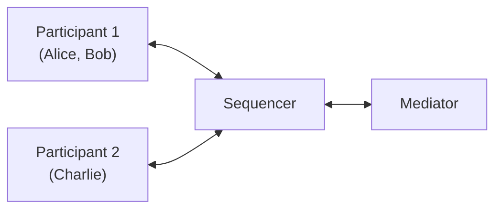
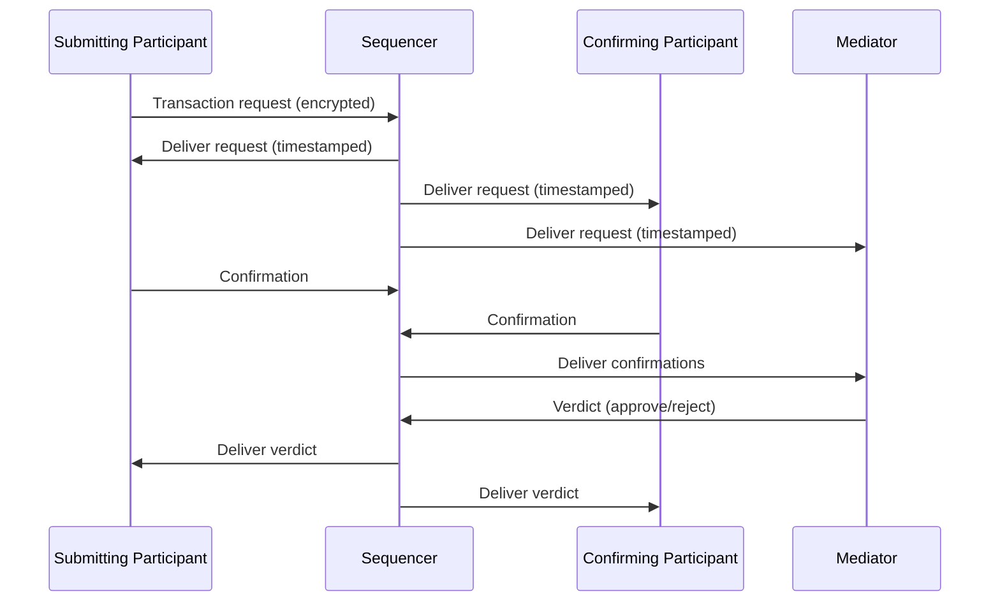

The previous page introduced sequencers and mediators. This page shows how they work together with participant nodes to process a transaction: how a request becomes a committed (or rejected) result.

## The cast of characters

Three types of nodes participate in the protocol:

| Node | Role |
|---|---|
| **Participant node** | Hosts parties, submits transactions, validates and confirms them. |
| **Sequencer** | Orders messages and delivers them to the right recipients. Does not read their contents. |
| **Mediator** | Collects confirmations from participants and decides whether a transaction is committed or rejected. |

Participants and mediators never talk to each other directly. All communication flows through the sequencer.

## Message flow: the two-phase commit

Canton uses a **two-phase commit** protocol, similar in spirit to two-phase commit in distributed databases. The goal is the same: ensure that all parties either agree on a transaction or none of them commit it.

### Phase 1: submit and confirm

1. **Submit.** A participant (the submitter) sends a transaction request to the sequencer. The request is encrypted so the sequencer cannot read the contract data.

2. **Order.** The sequencer assigns a timestamp to the request and delivers it to all participants whose parties are involved, plus the mediator.

3. **Validate.** Each receiving participant decrypts its portion of the transaction, runs the Daml contract logic, and checks that the transaction is well-formed and properly authorized.

4. **Confirm or reject.** Each participant sends its response (confirmation or rejection) back through the sequencer to the mediator.

### Phase 2: decide and distribute

5. **Decide.** The mediator collects all responses. If every required confirmer approved before the deadline, the mediator produces an "approve" verdict. If any required confirmer rejects, or the deadline passes, the verdict is "reject."

6. **Distribute.** The sequencer delivers the verdict to all involved participants.

7. **Commit.** Participants that receive an "approve" verdict update their active contract set. Participants that receive a "reject" verdict discard the transaction.

## What the sequencer guarantees

The sequencer is the backbone of the protocol. It provides three guarantees:

1. **Total ordering.** Every message gets a unique timestamp. All recipients see messages in the same order. This prevents conflicts like two transactions trying to archive the same contract.

2. **Authenticated delivery.** Every message comes with cryptographic proof of its origin. Recipients can verify that a message was actually sequenced (not forged).

3. **Privacy.** The sequencer delivers encrypted payloads. It knows who is sending to whom, but it cannot read the transaction contents. Recipients of a message also do not learn the identity of the sender.

## What the mediator guarantees

The mediator acts as the commit coordinator. It provides two guarantees:

1. **Consistent verdicts.** The mediator produces exactly one verdict per transaction, and all participants receive the same verdict.

2. **Timeout enforcement.** If a confirming participant does not respond before the deadline, the mediator rejects the transaction rather than waiting indefinitely.

The mediator sees which parties are involved and whether they confirmed, but (like the sequencer) it does not see the actual contract data.

## Why indirect communication?

You might wonder why participants do not just talk to each other directly. Routing everything through the sequencer provides two critical properties:

- **Consistent ordering.** Without a shared ordering service, participants could disagree about which transaction came first, leading to conflicting ledger states.
- **Sender privacy.** Because participants receive messages from the sequencer (not directly from each other), a confirming participant does not learn which participant submitted the transaction.

## Next step

Now that you understand how the protocol works, the next page covers the security properties and trust assumptions that Canton provides.
