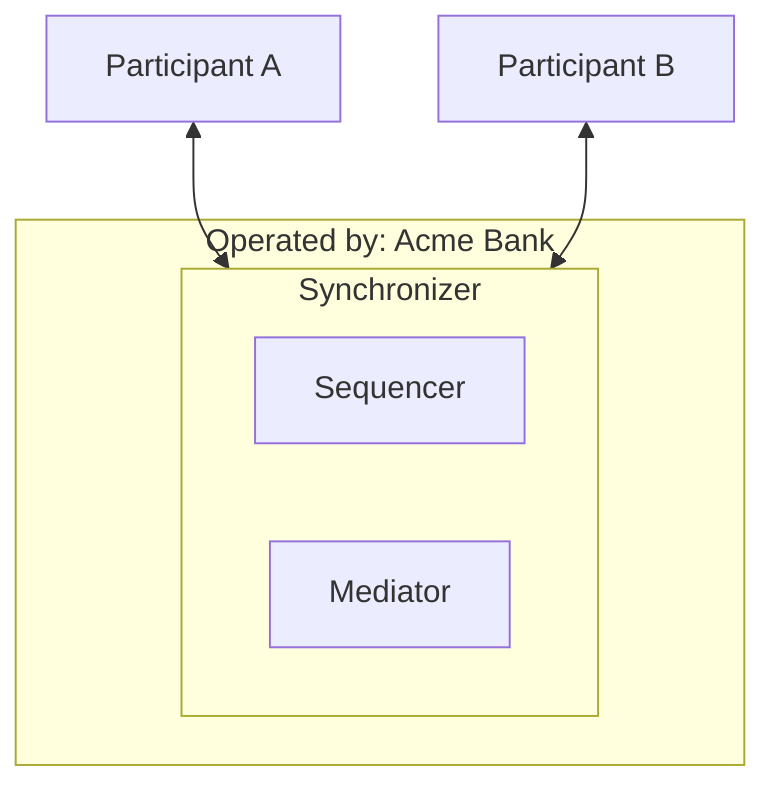
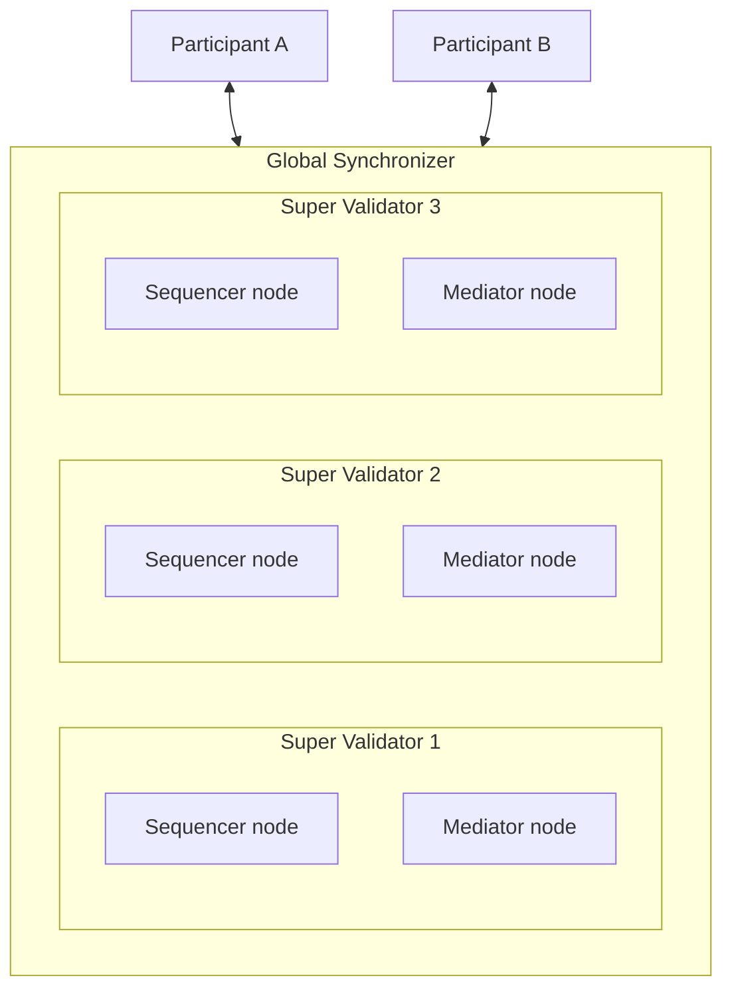

The previous page showed how Canton enforces privacy at the transaction level. This page introduces the synchronizer: the infrastructure layer that coordinates participants without seeing their data.

## What is a synchronizer?

A synchronizer is the coordination layer between participant nodes. It does not run Daml contracts or store contract data. Its only job is to ensure that participants agree on the order and outcome of transactions.

A synchronizer consists of two types of components:

| Component | Responsibility |
|---|---|
| **Sequencer** | Orders messages and delivers them to recipients. |
| **Mediator** | Collects confirmations and produces transaction verdicts. |

## Who runs a synchronizer?

A synchronizer is owned by one entity or a group of entities. The owners control which sequencer and mediator nodes run on the synchronizer.

In simple setups, a single company runs everything:

In larger networks, the synchronizer owners choose a specific sequencer and mediator implementation, and multiple organizations each run their own instance of that same software. This way, no single operator has full control. For example, the [Global Synchronizer](https://sync.global/docs/) is operated by a network of independent organizations ("Super Validators") who jointly run the sequencers using Byzantine Fault Tolerant (BFT) consensus and mediators with BFT state machine replication:

Synchronizer operators charge fees for traffic. Running a sequencer incurs significant infrastructure costs, and the fee model ensures that participants pay for the resources they consume. This also protects the network from abuse, since submitting messages has a cost.

## Sequencers in detail

The sequencer is the message backbone of Canton. Every protocol message between participants and mediators flows through it.

### What the sequencer does

- **Assigns timestamps.** Every batch of messages gets a unique, globally ordered timestamp. This is what gives Canton its total ordering guarantee.
- **Delivers messages to recipients.** The submitter specifies who should receive each message. The sequencer routes accordingly.
- **Provides delivery proofs.** Each delivery includes cryptographic evidence that the sequencer actually processed and ordered the message. This prevents disputes about whether a message was sent.

### What the sequencer does not do

- **Read message contents.** Payloads are encrypted by the sender. The sequencer sees metadata (sender, recipients, size) but cannot decrypt the actual transaction data.
- **Make decisions.** The sequencer does not approve or reject transactions. It only orders and delivers.

### Sequencer backends

Canton supports multiple sequencer backends. The choice is made at the synchronizer level, and all sequencer nodes on a given synchronizer run the same technology:

| Backend | When to use it |
|---|---|
| **Relational database** (e.g., PostgreSQL) | Simpler deployments where a single entity operates the sequencer. |
| **BFT consensus** (Byzantine Fault Tolerant) | Multi-operator deployments where operators do not fully trust each other. |
| **Distributed ledgers** (e.g., CometBFT, Hyperledger Fabric) | Deployments that want to leverage an existing blockchain infrastructure for ordering. |

### Multiple sequencers

A synchronizer can have more than one sequencer. Participants can connect to any of them. This provides redundancy: if one sequencer goes down, participants can switch to another without losing data.

## Mediators in detail

The mediator is the decision-maker in the two-phase commit protocol.

### What the mediator does

- **Collects confirmations.** After the sequencer delivers a transaction request to participants, each confirming participant sends a response. The mediator collects these responses.
- **Produces a verdict.** If all required confirmers approve before the deadline, the mediator approves the transaction. If any reject, or the deadline passes, the mediator rejects it.
- **Records the outcome.** The mediator persists every verdict for auditability. If a dispute arises later, there is a record of what happened and why.

### What the mediator does not do

- **See contract data.** Like the sequencer, the mediator works with encrypted payloads. It knows which parties are involved and whether they confirmed, but not what the transaction contains.
- **Override party decisions.** The mediator cannot force a transaction through if a required confirmer rejects it.

### Mediator groups

A synchronizer can split its mediator workload across multiple **mediator groups**. Each group handles a subset of transactions. This allows the coordination layer to scale horizontally as transaction volume grows.

## Trust model

A key design principle of Canton is that trust in the synchronizer is limited and explicit:

| Trust assumption | What it means |
|---|---|
| The sequencer orders messages correctly. | If the sequencer misordered messages, participants could end up with inconsistent ledger states. |
| The sequencer delivers messages to the specified recipients. | If the sequencer dropped messages, transactions could stall. |
| The mediator produces correct verdicts. | If the mediator approved a transaction that should have been rejected, the ledger could become inconsistent. |
| The sequencer does not store data longer than necessary. | The sequencer handles encrypted payloads, but it should not retain them indefinitely. |

Importantly, the synchronizer is **not** trusted with:

- **Contract data.** All payloads are encrypted. The synchronizer cannot read them.
- **Business logic.** The synchronizer does not execute Daml code. It only coordinates.
- **Unilateral control.** The synchronizer cannot create, modify, or archive contracts on its own.

This limited trust model is what allows independent organizations to share a synchronizer without handing over control of their data.

## Synchronizer membership

Participant nodes must explicitly join a synchronizer. When a participant connects:

1. It submits its identity information (keys and certificates) to the synchronizer.
2. It issues a trust certificate specific to that synchronizer, signaling that it consents to being a member.
3. The synchronizer distributes this information to other members.

This is a two-way relationship: the participant chooses to join, and the synchronizer accepts the participant according to its governance rules. A participant can connect to multiple synchronizers simultaneously.

## Next step

Now that you know what synchronizers are made of, the next page shows how these components coordinate to process a transaction: the two-phase commit protocol.
