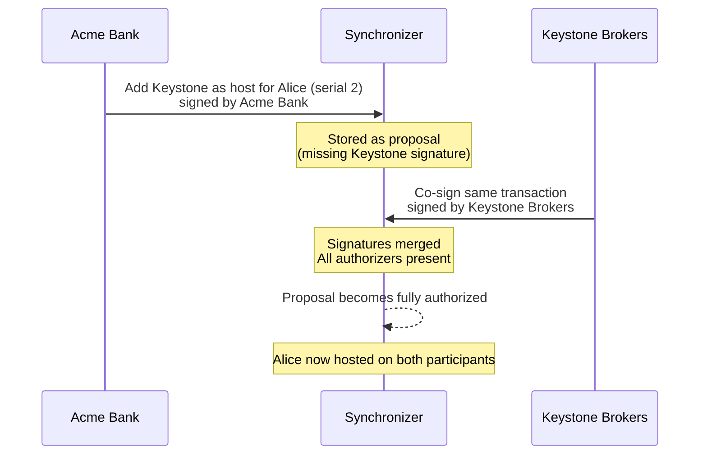
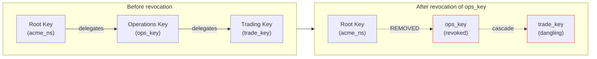

You have seen how participants host parties, how synchronizers coordinate transactions, and how the two-phase commit protocol produces a verdict. But all of that assumes something fundamental: every node already knows who the other nodes are, which keys to trust, and which participant hosts which party.

How does that shared knowledge get established in the first place? And how does it change over time, without a central authority managing it? That is what topology management handles.

## What topology manages

Consider the Global Synchronizer. Super Validators are already running the sequencers and mediators. Now Acme Bank wants to join as a participant so its customers (like Alice) can transact on the network. Before that can happen, every node on the synchronizer needs to know:

- That Acme Bank's participant exists and is a member of this synchronizer
- What cryptographic keys Acme Bank's participant uses
- Which parties (customers) Acme Bank hosts, and with what permissions

This information is the **topology state**. Topology management is the system that creates, updates, and distributes this state across all nodes. Every node runs the same validation logic independently, so they always reach the same conclusion about the current topology. There is no central registry or single authority that controls it.

## Design principles

To build a system like this without a central authority, Canton follows four principles:

1. **No single trust anchor.** There is no single authority for establishing identities. Any organization (Acme Bank, Keystone Brokers, Apex Insurance) can bootstrap its own identity independently.

2. **Key-based identity.** Identity is based on cryptographic keys. Acme Bank proves it is Acme Bank by signing with its private key, and others verify using the corresponding public key. If you have used SSH keys or GPG, the mental model is similar.

3. **Separation of cryptographic and legal identity.** Canton only cares about cryptographic identity for processing transactions. The fact that key `acme_ns` belongs to a company called "Acme Bank" is established outside the protocol (through legal agreements, contracts, etc.). This is analogous to how a TLS certificate proves you control a domain, not that you are a particular company.

4. **Asymmetric identity needs.** Large organizations like Acme Bank often want to be publicly identifiable, while individual customers like Alice may prefer to remain pseudonymous. Canton accommodates both.

## Identities and namespaces

Every organization on a Canton network controls its own **namespace**. Think of it like a domain name: Acme Bank controls `acme_ns`, Keystone Brokers controls `keystone_ns`, and neither needs the other's permission. A namespace is created by generating a root key pair and publishing a self-signed certificate that declares the key as the authority for that namespace.

Every identity (a node, a party) is represented by a **unique identifier (UID)** in the format `identifier::namespace`. For example, `alice::acme_ns` is Alice at Acme Bank, while `alice::keystone_ns` is a completely different Alice at Keystone Brokers. The namespace makes each identity globally unique.

### Who controls a party's identity?

Canton supports three models for how a party's identity is managed, depending on how much control the party wants.

#### Hosted party

In a retail banking scenario, Alice is a regular customer of Acme Bank. Her party is created in Acme Bank's namespace: `alice::acme_ns`. Acme Bank controls Alice's identity and submits transactions on her behalf. Alice trusts Acme Bank to act correctly, similar to how you trust your bank to process your payments.

This is the simplest model and the default. Most parties on a Canton network work this way.

#### Decoupled party

In an institutional setting, Alice is a large asset manager. She wants to use Acme Bank's infrastructure for execution, but she does not want Acme Bank to control her identity. Alice creates her own namespace (`alice_ns`) and her UID becomes `alice::alice_ns`. Acme Bank's participant still hosts her and submits transactions, but Alice's namespace owner retains control over her identity.

#### External party

In a decentralized exchange scenario, Alice is a trader who does not want any single participant to have submission rights over her transactions. Alice holds her own signing keys and signs every transaction herself. No participant can act on her behalf without her explicit cryptographic approval for each transaction.

In this model, any participant node can prepare a transaction for Alice, but it will not be submitted until Alice signs it with her own key. Multiple confirming participants validate the transaction, but none of them control Alice's identity or can submit without her signature.

## Topology transactions

The topology state is stored as a key-value map, similar to a dictionary or hash map in code. Each entry has a unique key (determined by the type and content of the mapping) and a value. Topology transactions are the operations that modify this map.

For example, when Acme Bank registers Alice as a party hosted on its participant, that is a topology transaction. When Keystone Brokers joins the synchronizer, that is also a topology transaction.

Every topology transaction contains:

| Field | Purpose |
|---|---|
| **Mapping** | The content: what is being changed (e.g., Acme Bank hosts Alice). |
| **Serial** | A version number, starting at 1 and incrementing by exactly 1 for each change to the same key. |
| **Operation** | Either `REPLACE` (create or update) or `REMOVE` (deactivate). |
| **Signatures** | Cryptographic signatures from the required authorizers. |

### How serials prevent replay attacks

Serials work like version numbers. Suppose a malicious actor captures the topology transaction where Acme Bank registered Alice (serial 1). If they try to replay it later, the serial will not match the expected next value, and every node will reject it. No gaps or repetitions are allowed: going from serial 1 to serial 3, or submitting serial 1 twice with different content, is invalid.

## Types of topology mappings

Each mapping type governs a different aspect of the synchronizer's shared state:

| Mapping | What it controls | Example |
|---|---|---|
| **NamespaceDelegation** | Delegates authority from a root key to intermediate keys. | Acme Bank delegates signing authority to an operational key. |
| **OwnerToKeyMapping** | Declares which signing and encryption keys a node uses. | Acme Bank's participant registers its protocol keys. |
| **PartyToParticipant** | Defines which participants host a party and with what permissions. | Alice is hosted on Acme Bank's participant with Submission permission. |
| **VettedPackages** | Lists the Daml packages a participant agrees to run. | Acme Bank opts in to running a specific trading contract. |
| **SynchronizerTrustCertificate** | A participant's signal that it wants to be a member of a specific synchronizer. | Acme Bank issues a trust certificate for the Global Synchronizer. |
| **SequencerSynchronizerState** | Lists all sequencers of a synchronizer. Controlled by the synchronizer owners. | The Super Validators register their sequencer nodes. |
| **MediatorSynchronizerState** | Lists all mediators of a synchronizer. Also controlled by the synchronizer owners. | The Super Validators register their mediator nodes. |

## Party hosting permissions

When Acme Bank hosts Alice, it does so with a specific permission level assigned by Alice's namespace owner. There are three levels, and each one includes the previous:

| Permission | What Acme Bank's participant can do for Alice |
|---|---|
| **Observation** | Receive notifications about transactions involving Alice. Read-only access. |
| **Confirmation** | Confirm or reject transactions on Alice's behalf during the two-phase commit. Includes Observation. |
| **Submission** | Submit new transactions on Alice's behalf. Includes Confirmation. |

Both Alice's namespace owner and Acme Bank must sign the `PartyToParticipant` mapping. Alice's side consents to Acme Bank handling her data, and Acme Bank accepts the operational responsibilities of hosting.

**A word of caution:** the distinction between Submission and Confirmation is enforced at the participant level, not by the synchronizer. A malicious participant with Confirmation permission could technically submit transactions for Alice, because Canton's privacy model hides the identity of the submitting participant from validators. Choose hosting participants carefully.

## Proposals and multi-signature authorization

Many topology changes require signatures from multiple organizations. Canton handles this through a proposal workflow.

### How proposals work

When a topology transaction does not yet have all required signatures, Canton nodes treat it as a **proposal**. Proposals are stored but do not affect the active topology state. As additional organizations submit their signatures for the same transaction, nodes merge the signatures. Once all required signatures are present, the proposal becomes a fully authorized topology transaction.

Proposals do not expire. They remain pending until enough signatures arrive to make them fully authorized.

### Example: Alice moves to a second participant

Suppose Alice is currently hosted only on Acme Bank's participant. She wants to also be hosted on Keystone Brokers' participant (for redundancy or to trade directly through their platform).

1. Acme Bank (Alice's namespace owner) submits a new `PartyToParticipant` mapping (serial 2) that adds Keystone Brokers as a host, signed with Acme Bank's key.
2. Since the authorization rules require signatures from both Acme Bank and Keystone Brokers, the transaction is stored as a proposal.
3. Keystone Brokers reviews the request and submits their signature.
4. Nodes merge the signatures. The proposal now has all required authorizations and becomes the active topology state. Alice is now hosted on both participants.



## Authorization chains and key delegation

In practice, you do not want Acme Bank's root namespace key sitting on a live server. If it were compromised, the attacker would control Acme Bank's entire namespace. Canton supports delegation chains that let you move the root key to a secure offline location while still being able to manage topology day-to-day.

### How delegation works

Starting from its root key, Acme Bank creates `NamespaceDelegation` mappings that grant signing authority to intermediate keys:

```
Acme Bank Root Key (acme_ns)
  └─ delegates to → Operations Key (ops_key) [can sign all but namespace delegations]
       └─ delegates to → Trading Key (trade_key) [can sign specific mappings only]
```

When a node validates a topology transaction signed by `trade_key`, it traces the delegation chain back to the root: `acme_ns → ops_key → trade_key`. If every link in the chain is valid at the transaction's effective time, the signature is accepted.

### Three restriction levels

Each delegation can restrict what the target key is allowed to sign:

| Restriction | What the key can sign |
|---|---|
| **CanSignAllMappings** | Everything, including further namespace delegations. Full authority. |
| **CanSignAllButNamespaceDelegations** | All topology mappings except `NamespaceDelegation`. Ideal for a key used in daily operations while the root key stays offline. |
| **CanSignSpecificMappings** | Only the explicitly listed mapping types. Limits the damage if the key is compromised. |

This is analogous to role-based access control: Acme Bank grants each key the minimum permissions it needs, reducing risk if any single key is compromised.

### Key revocation

If Acme Bank's operations key is compromised, Acme Bank can revoke its delegation by submitting a `NamespaceDelegation` with the `REMOVE` operation. Revocation cascades: any keys that were delegated through the revoked key (like the trading key) become "dangling" and are no longer accepted for signing new topology transactions.

Importantly, revocation is not retroactive. Topology transactions that were successfully validated before the revocation remain valid. Only future signatures from the revoked (or dangling) key are rejected.



## Putting it all together

Earlier pages showed how transactions flow through the network. This page covered the layer that makes that possible: the shared knowledge about who exists, what they can do, and why they should be trusted.

- **Namespaces** let any organization (Acme Bank, Keystone Brokers) establish its own root of trust independently.
- **Unique identifiers** give every party and node a globally unambiguous name.
- **Topology transactions** modify the shared state through a process that every node validates independently.
- **Serials** prevent replay attacks by enforcing strict version ordering.
- **Proposals** let multiple organizations coordinate their signatures before a change takes effect.
- **Delegation chains** allow root keys to be stored securely offline while operational keys handle day-to-day work.
