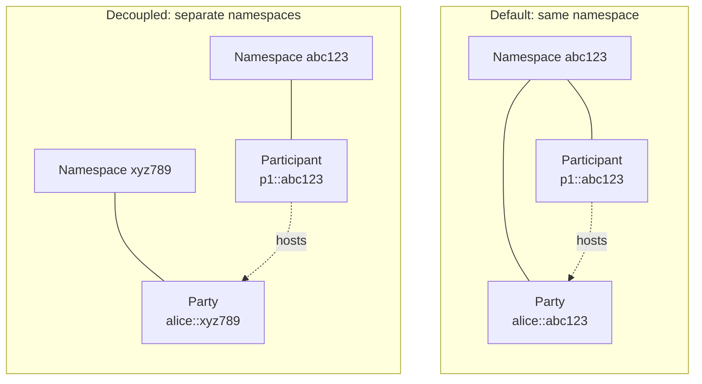
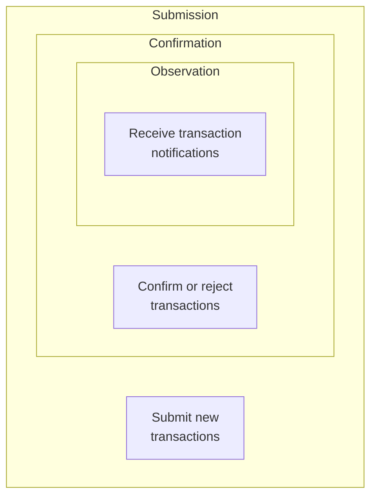
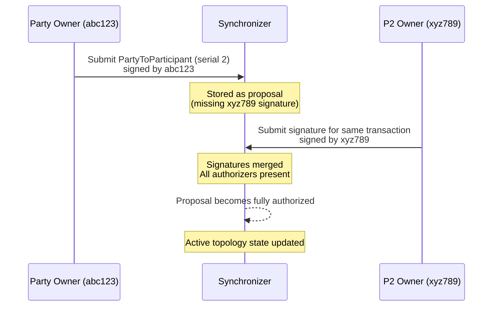
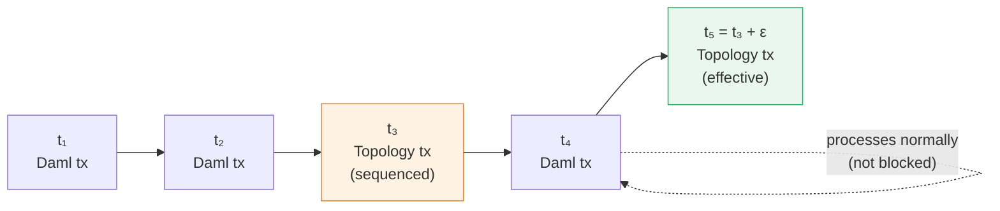
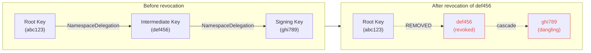

Topology management is the trust layer underneath everything in Canton. Before any Daml transaction can be processed, every node on a Synchronizer must agree on a shared set of facts: who the parties are, which participants host them, and who is allowed to do what. Topology management is how that shared understanding is established and maintained.

## The problem topology solves

Imagine a distributed system where multiple independent organizations run their own nodes, yet all need to agree on the same set of rules. Without a central authority to hand out credentials, how does any node know which keys to trust or which party lives on which participant?

Canton solves this with a replicated state machine. Every node independently validates topology changes against the same deterministic rules. Because the rules are deterministic, all nodes connected to a Synchronizer reach the same conclusion about the topology state at any given time.

If you are familiar with distributed systems, think of it as consensus without a leader: there is no single component that gates topology changes.

## Design principles

Four principles shape how Canton handles identity and topology:

1. **No single trust anchor.** Just as there is no single globally trusted entity for synchronizing Daml transactions, there is no single authority for establishing identities. Any entity can bootstrap its own namespace.

2. **Key-based identity.** A Canton key holder is an entity that can authorize actions (by signing with a private key) and whose actions others can verify (using the corresponding public key). If you have used SSH keys or GPG, the mental model is similar.

3. **Separation of cryptographic and legal identity.** Canton only cares about cryptographic identity for processing transactions. Mapping a cryptographic key to a real-world legal entity (a company, a person) is a separate concern, handled outside the protocol. This is analogous to how a TLS certificate proves you control a domain, not that you are a particular company.

4. **Asymmetric identity needs.** Large organizations often want to be publicly identifiable ("BANK"), while individuals may prefer to remain pseudonymous. Identity requirements vary by role, and Canton accommodates both ends of the spectrum.

## Namespaces and unique identifiers

### Namespaces

A namespace is the root of a trust hierarchy. It is defined by the fingerprint of a root public key. The root key signs a self-referencing certificate that says: "I, key `abc123`, am the authority for namespace `abc123`."

This is similar to a self-signed root CA certificate in web PKI: everything under that root is trusted because the root says so.

### Unique identifiers (UIDs)

Every identity in Canton (a node, a party) is represented by a unique identifier with the format:

```
identifier::namespace
```

For example:

| UID | What it represents |
|---|---|
| `alice::abc123` | A party named "alice" in namespace `abc123` |
| `p1::abc123` | A participant node in namespace `abc123` |
| `alice::xyz789` | A different "alice" in a different namespace |

Two UIDs can share the same identifier (like `alice`) as long as their namespaces differ. The namespace owner controls all UIDs within that namespace.

### Party identity vs. node identity

By default, parties are created within the namespace of their hosting participant node. This means the participant's namespace owner controls the party. However, you can decouple party ownership from hosting by creating a party in a separate namespace. The participant can still host the party, but the party's namespace owner retains control.



In the decoupled case, the party owner (namespace `xyz789`) retains control over the party even though a participant in a different namespace hosts it.

## Topology transactions

The topology state is a key-value map. Each entry maps a unique key (derived from the mapping type and content) to a value. Topology transactions are the operations that modify this map.

Every topology transaction contains:

| Field | Purpose |
|---|---|
| **Mapping** | The content: what is being changed (e.g., which participant hosts a party). |
| **Serial** | A version number, starting at 1 and incrementing by exactly 1 for each change to the same key. |
| **Operation** | Either `REPLACE` (create or update) or `REMOVE` (deactivate). |
| **Signatures** | Cryptographic signatures from the required authorizers. |

### How serials prevent replay attacks

Serials work like optimistic concurrency control in a database. If a malicious actor captures a valid topology transaction and tries to replay it later, the serial will not match the expected next value, and every node will reject it. No gaps or repetitions are allowed: going from serial 1 to serial 3, or submitting serial 1 twice with different content, is invalid.

## Types of topology mappings

Each mapping type governs a different aspect of the Synchronizer's shared state:

| Mapping | What it controls |
|---|---|
| **NamespaceDelegation** | Delegates authority from a root key to intermediate keys. The root certificate is a self-signed instance of this mapping. |
| **OwnerToKeyMapping** | Declares which signing and encryption keys a Canton node uses for protocol messages. |
| **PartyToParticipant** | Defines which participant nodes host a party and with what permissions. |
| **VettedPackages** | Lists the Daml packages a participant agrees to run. Participants must explicitly opt in to running third-party code. |
| **SynchronizerTrustCertificate** | A participant's explicit signal that it wants to be a member of a specific Synchronizer. Scoped to one Synchronizer, so it cannot be replayed on another. |
| **SequencerSynchronizerState** | Lists all sequencers of a Synchronizer. Controlled by the Synchronizer owners. |
| **MediatorSynchronizerState** | Lists all mediators (or mediator groups) of a Synchronizer. Also controlled by the Synchronizer owners. |

## Party hosting permissions

When a participant hosts a party, the party's owner assigns one of three permission levels. Each level subsumes the previous one:

| Permission | What the participant can do |
|---|---|
| **Observation** | Receive notifications about transactions involving the party. Read-only access. |
| **Confirmation** | Confirm or reject Daml transactions during the two-phase commit protocol. Includes Observation. |
| **Submission** | Submit new Daml transactions on behalf of the party. Includes Confirmation. |



Both the party owner and the participant must sign the `PartyToParticipant` mapping. The party owner consents to the participant handling its data, and the participant accepts the operational responsibilities of hosting.

> [!IMPORTANT]
> The distinction between Submission and Confirmation is enforced at the participant level, not by the Synchronizer. A malicious participant with Confirmation permission could technically submit transactions for the party, because Canton's privacy model hides the identity of the submitting participant from validators. Choose your hosting participants carefully.

## Proposals and multi-signature authorization

Many topology changes require signatures from multiple key holders. Canton handles this through a proposal workflow.

### How proposals work

When a topology transaction does not yet have all required signatures, Canton nodes treat it as a **proposal**. Proposals are stored but do not affect the active topology state. As additional key holders submit their signatures for the same transaction, nodes merge the signatures. Once all required signatures are present, the proposal becomes a fully authorized topology transaction.

Proposals do not expire. They remain pending until either enough signatures arrive or a competing transaction for the same key is fully authorized first.

### Competing proposals

If two proposals target the same unique key with the same serial but different content, they are competing. The first one to become fully authorized wins, and all other proposals for that key and serial are automatically invalidated.

Think of it like a race condition resolved by first-write-wins: whichever proposal collects all its signatures first becomes the accepted state.

### Example: adding a new hosting participant

Suppose party `Alice::abc123` is currently hosted on `P1::abc123`. The party owner wants to add `P2::xyz789` as an additional host.

1. The party owner submits a new `PartyToParticipant` mapping (serial 2) that includes `P2::xyz789`, signed with their key for namespace `abc123`.
2. Since the authorization rules require signatures from both `abc123` and `xyz789`, the transaction is stored as a proposal.
3. The owner of `P2::xyz789` reviews and submits their signature.
4. Nodes merge the signatures. The proposal now has all required authorizations and becomes the active topology state.



## Future dating: why topology changes are not instant

When a topology transaction is sequenced at time `t`, it does not take effect immediately. Instead, it becomes effective at time `t + ε`, where `ε` is the topology change delay (a configurable Synchronizer parameter).

### Why the delay exists

Without the delay, every topology transaction would temporarily pause all other message processing. Nodes would need to wait for the topology change to be fully processed before they could be sure their topology snapshot is complete.

With future dating, messages sequenced between `t` and `t + ε` can be processed normally, because nodes know that no topology change will affect the state before `t + ε`. This is similar to a cooldown period: the system signals that a change is coming, giving everyone time to process in-flight work uninterrupted.



Because the topology change at `t₃` only takes effect at `t₅`, the Daml transaction at `t₄` can be processed immediately using a topology snapshot that is guaranteed to be complete.

### The trade-off

A larger `ε` means less disruption to transaction processing but longer waits before topology changes take effect. A smaller `ε` means faster topology updates but more potential for processing pauses. In practice, `ε` should be just large enough to cover the time it takes to process a topology transaction.

## Authorization chains and key delegation

In practice, you do not want your root namespace key sitting on a live server. Canton supports delegation chains that let you move the root key to cold storage while still being able to manage topology day-to-day.

### How delegation works

Starting from the root key, you create `NamespaceDelegation` mappings that grant signing authority to intermediate keys:

```
Root Key (abc123)
  └─ delegates to → Key1 (def456) [can sign all but namespace delegations]
       └─ delegates to → Key2 (ghi789) [can sign specific mappings only]
```

When a node validates a topology transaction signed by `Key2`, it traces the delegation chain back to the root: `abc123 → def456 → ghi789`. If every link in the chain is valid at the transaction's effective time, the signature is accepted.

### Three restriction levels

Each delegation can restrict what the target key is allowed to sign:

| Restriction | What the key can sign |
|---|---|
| **CanSignAllMappings** | Everything, including further namespace delegations. Full authority. |
| **CanSignAllButNamespaceDelegations** | All topology mappings except `NamespaceDelegation`. Ideal for a "daily driver" key when the root key is in cold storage. |
| **CanSignSpecificMappings** | Only the explicitly listed mapping types. Limits the blast radius if the key is compromised. |

This is analogous to role-based access control (RBAC): you grant the minimum permissions each key needs, reducing risk if any single key is compromised.

### Key revocation

If an intermediate key is compromised or no longer needed, you can revoke its delegation by submitting a `NamespaceDelegation` with the `REMOVE` operation. Revocation cascades: any keys that were delegated through the revoked key become "dangling" and are no longer accepted for signing new topology transactions.

Importantly, revocation is not retroactive. Topology transactions that were successfully validated before the revocation remain valid. Only future signatures from the revoked (or dangling) key are rejected.



## Putting it all together

Topology management is how Canton nodes build and maintain a shared, trustworthy picture of the network without relying on a central authority. The key ideas to remember:

- **Namespaces** establish independent roots of trust, each backed by a cryptographic key.
- **Unique identifiers** give every party and node a globally unambiguous name.
- **Topology transactions** modify a shared key-value map through a deterministic, replicated state machine.
- **Serials** prevent replay attacks and ensure ordered evolution of each mapping.
- **Proposals** enable multi-party authorization workflows where signatures accumulate over time.
- **Future dating** keeps topology changes from blocking normal transaction processing.
- **Delegation chains** allow root keys to be stored securely offline while intermediate keys handle day-to-day operations.
