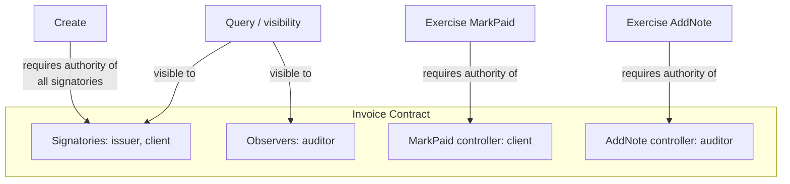

The previous pages introduced signatories and controllers in passing. This page explains the full authorization model: the three roles a party can play on a contract, what each role grants, and how the ledger enforces these rules.

## The three roles

Every party's relationship to a contract falls into one of three roles:

| Role | Can see the contract? | Must authorize creation? | Can exercise choices? |
|---|---|---|---|
| **Signatory** | Yes, always | Yes | Only if also a controller |
| **Observer** | Yes | No | Only if also a controller |
| **Controller** | Must be a signatory or observer | No | Yes, for the specific choice |

A party can hold multiple roles. For example, a signatory can also be the controller of a choice.

## Signatories

A **signatory** is a party that must authorize the creation of a contract. Creating a contract without the consent of all its signatories will be rejected by the ledger.

Signatories have two guarantees:

1. **They always see the contract.** The ledger guarantees that signatories are notified when a contract is created and when it is archived.
2. **They must consent to creation.** No one can put a signatory into an obligation without their agreement.

Every template must have at least one signatory.

### When to make a party a signatory

If a contract creates an **obligation** for a party, that party must be a signatory. This is how Daml prevents one party from unilaterally creating obligations for another.

In the `PaymentObligation` example from earlier pages, both `debtor` and `creditor` are signatories because the contract creates obligations for both: the debtor is obligated to pay, and the creditor is bound by the terms of the contract.

## Observers

An **observer** is a party who can see a contract but does not need to authorize its creation. Observers are useful when a party needs visibility without responsibility.

```daml
template Invoice
  with
    issuer : Party
    client : Party
    auditor : Party
    amount : Decimal
    description : Text
  where
    ensure amount > 0.0

    signatory issuer, client
    observer auditor
```

In this example, the `auditor` can see every `Invoice` they are listed on, but they do not need to consent to invoice creation. The issuer and client are signatories (both must agree), while the auditor is an observer (informed but not required to authorize).

### Key properties of observers

- Observers **do not authorize creation**. Adding someone as an observer does not require their consent.
- Observers **can see the contract** and are notified of its creation and archival.
- Observers **cannot exercise choices** unless they are also a controller on that choice.
- Signatories are **automatically observers**. You never need to list a signatory as an observer.

## Controllers

A **controller** is the party (or parties) allowed to exercise a specific choice. The `controller` clause on a choice determines who can trigger that action.

```daml
    choice MarkPaid : ()
      controller client
      do
        pure ()

    nonconsuming choice AddNote : ContractId InvoiceNote
      with
        note : Text
      controller auditor
      do
        create InvoiceNote
          with
            invoice = self
            author = auditor
            note
```

Here, `client` controls `MarkPaid` and `auditor` controls `AddNote`. The ledger enforces this: the auditor cannot mark an invoice as paid, and the client cannot add audit notes.

### Controllers must be stakeholders

A controller must be either a signatory or an observer of the contract. If a party is neither, they cannot see the contract, so they cannot exercise choices on it. This is why the `auditor` is listed as an `observer`: without that line, the auditor could not see the contract and could not exercise `AddNote`.

## Authorization rules

Daml enforces authorization at three points: creation, exercise, and archival.

### Creating a contract

Creating a contract requires the authority of **all signatories**. If any signatory's authority is missing, the ledger rejects the transaction.

```daml
testCreationRequiresAllSignatories : Script ()
testCreationRequiresAllSignatories = script do
  alice <- allocateParty "Alice"
  bob <- allocateParty "Bob"
  auditor <- allocateParty "Auditor"

  -- Alice alone cannot create the invoice (Bob is also a signatory)
  submitMustFail alice do
    createCmd Invoice
      with
        issuer = alice
        client = bob
        auditor = auditor
        amount = 500.0
        description = "Consulting services"

  -- Both together can create it
  submit (actAs [alice, bob]) do
    createCmd Invoice
      with
        issuer = alice
        client = bob
        auditor = auditor
        amount = 500.0
        description = "Consulting services"
```

### Exercising a choice

Exercising a choice requires the authority of **all controllers** listed on that choice. The ledger checks this regardless of how the transaction is submitted.

```daml
  -- Auditor cannot exercise MarkPaid (only the client can)
  submitMustFail auditor do
    exerciseCmd invoiceCid MarkPaid

  -- Client (Bob) can exercise MarkPaid
  submit bob do
    exerciseCmd invoiceCid MarkPaid
```

### Archiving a contract

The built-in `Archive` choice is implicitly added to every template. Its controllers are all the signatories. This means archiving a contract requires the authority of all signatories, just like creation.

When a consuming choice is exercised, the archival happens automatically as part of the exercise. The controller's authority to exercise the choice, combined with the signatories' prior consent (given when they signed the contract), is sufficient for the archival.

## Visibility in practice

Visibility determines which contracts a party can see when they query the ledger. The rule is straightforward:

- **Signatories** see the contract (always).
- **Observers** see the contract (always).
- **Everyone else** does not see the contract.

```daml
testObserverVisibility : Script ()
testObserverVisibility = script do
  alice <- allocateParty "Alice"
  bob <- allocateParty "Bob"
  auditor <- allocateParty "Auditor"

  submit (actAs [alice, bob]) do
    createCmd Invoice
      with
        issuer = alice
        client = bob
        auditor = auditor
        amount = 500.0
        description = "Consulting services"

  -- Auditor can see the invoice (they are an observer)
  auditorInvoices <- query @Invoice auditor
  assertEq 1 (length auditorInvoices)

  -- Both signatories can see the invoice
  aliceInvoices <- query @Invoice alice
  assertEq 1 (length aliceInvoices)
```

A party not listed as a signatory or observer sees nothing:

```daml
  stranger <- allocateParty "Stranger"

  strangerInvoices <- query @Invoice stranger
  assertEq 0 (length strangerInvoices)
```

This connects directly to Canton's [privacy model](/canton-network/concepts). At the network level, participant nodes only receive the parts of a transaction that involve their parties. Daml's signatory and observer declarations determine which parties are involved.

## Summary of the authorization model



## Full code

Here is the complete `daml/Main.daml` for the authorization example:

```daml
module Main where

import DA.Assert
import Daml.Script

template Invoice
  with
    issuer : Party
    client : Party
    auditor : Party
    amount : Decimal
    description : Text
  where
    ensure amount > 0.0

    signatory issuer, client
    observer auditor

    choice MarkPaid : ()
      controller client
      do
        pure ()

    nonconsuming choice AddNote : ContractId InvoiceNote
      with
        note : Text
      controller auditor
      do
        create InvoiceNote
          with
            invoice = self
            author = auditor
            note

template InvoiceNote
  with
    invoice : ContractId Invoice
    author : Party
    note : Text
  where
    signatory author

testObserverVisibility : Script ()
testObserverVisibility = script do
  alice <- allocateParty "Alice"
  bob <- allocateParty "Bob"
  auditor <- allocateParty "Auditor"

  invoiceCid <- submit (actAs [alice, bob]) do
    createCmd Invoice
      with
        issuer = alice
        client = bob
        auditor = auditor
        amount = 500.0
        description = "Consulting services"

  auditorInvoices <- query @Invoice auditor
  assertEq 1 (length auditorInvoices)

  aliceInvoices <- query @Invoice alice
  assertEq 1 (length aliceInvoices)

  bobInvoices <- query @Invoice bob
  assertEq 1 (length bobInvoices)

testObserverCannotPay : Script ()
testObserverCannotPay = script do
  alice <- allocateParty "Alice"
  bob <- allocateParty "Bob"
  auditor <- allocateParty "Auditor"

  invoiceCid <- submit (actAs [alice, bob]) do
    createCmd Invoice
      with
        issuer = alice
        client = bob
        auditor = auditor
        amount = 500.0
        description = "Consulting services"

  submitMustFail auditor do
    exerciseCmd invoiceCid MarkPaid

  submitMustFail alice do
    exerciseCmd invoiceCid MarkPaid

  submit bob do
    exerciseCmd invoiceCid MarkPaid

testObserverExercisesOwnChoice : Script ()
testObserverExercisesOwnChoice = script do
  alice <- allocateParty "Alice"
  bob <- allocateParty "Bob"
  auditor <- allocateParty "Auditor"

  invoiceCid <- submit (actAs [alice, bob]) do
    createCmd Invoice
      with
        issuer = alice
        client = bob
        auditor = auditor
        amount = 500.0
        description = "Consulting services"

  submit auditor do
    exerciseCmd invoiceCid AddNote
      with note = "Reviewed and approved"

  invoices <- query @Invoice auditor
  assertEq 1 (length invoices)

testNonStakeholderCannotSee : Script ()
testNonStakeholderCannotSee = script do
  alice <- allocateParty "Alice"
  bob <- allocateParty "Bob"
  auditor <- allocateParty "Auditor"
  stranger <- allocateParty "Stranger"

  submit (actAs [alice, bob]) do
    createCmd Invoice
      with
        issuer = alice
        client = bob
        auditor = auditor
        amount = 500.0
        description = "Consulting services"

  strangerInvoices <- query @Invoice stranger
  assertEq 0 (length strangerInvoices)

testCreationRequiresAllSignatories : Script ()
testCreationRequiresAllSignatories = script do
  alice <- allocateParty "Alice"
  bob <- allocateParty "Bob"
  auditor <- allocateParty "Auditor"

  submitMustFail alice do
    createCmd Invoice
      with
        issuer = alice
        client = bob
        auditor = auditor
        amount = 500.0
        description = "Consulting services"

  submitMustFail bob do
    createCmd Invoice
      with
        issuer = alice
        client = bob
        auditor = auditor
        amount = 500.0
        description = "Consulting services"

  submit (actAs [alice, bob]) do
    createCmd Invoice
      with
        issuer = alice
        client = bob
        auditor = auditor
        amount = 500.0
        description = "Consulting services"

  pure ()
```

## Key takeaways

- **Signatories** must authorize creation and always see the contract. Use them for parties with obligations.
- **Observers** see the contract without authorizing creation. Use them for parties that need visibility only.
- **Controllers** determine who can exercise each choice. They must be signatories or observers.
- **Creating** a contract requires authority of all signatories.
- **Exercising** a choice requires authority of all its controllers.
- Parties not listed as signatories or observers **cannot see** the contract at all.

## Next step

You now understand who can see and act on contracts. The next page shows how to coordinate multiple parties in a real workflow using the propose-accept pattern, and how to model asset transfers.

<Cards>
  <Card title="Multi-party workflows" href="/daml/multi-party-workflows" />
</Cards>
