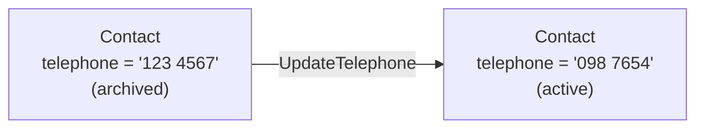

In the previous pages, you created a `PaymentObligation` contract and tested it. You saw that exercising the `Pay` choice archives the contract, removing it from the ledger. But what if you don't want to remove a contract, just change one of its fields?

In most programming languages, you would update a field in place: `contact.telephone = "new number"`. Daml does not work this way. Contracts are **immutable**. Once a contract is created, its data never changes. To represent a state change, you archive the old contract and create a new one with the updated data.

This pattern is called **consume-and-recreate**, and it is fundamental to how Daml works.

## Why immutability?

Daml runs on a distributed ledger where multiple parties independently validate transactions. If contracts could be mutated in place, parties could disagree about the current state. Immutability eliminates this: every party can independently verify the chain of create and archive actions that led to the current state.

This is similar to the UTXO (Unspent Transaction Output) model used in Bitcoin and other ledger systems. Each contract is like a "coin": you can spend it (archive) and produce new coins (create), but you cannot change a coin that already exists.

## The active contract set

At any point in time, the **active contract set (ACS)** is the collection of all contracts that have been created but not yet archived. The ACS changes in only two ways:

- A new contract is **created**, adding it to the set.
- An existing contract is **archived**, removing it from the set.

There is no "update" operation. If you think in database terms: Daml only has INSERT and DELETE, never UPDATE.

## Consuming choices: the default

When you define a choice without any modifier, it is **consuming** by default. Exercising a consuming choice automatically archives the contract before executing the choice body.

Here is a `Contact` template with a consuming choice:

```daml
template Contact
  with
    owner : Party
    name : Text
    telephone : Text
    address : Text
  where
    signatory owner

    choice UpdateTelephone : ContractId Contact
      with
        newTelephone : Text
      controller owner
      do
        create this with telephone = newTelephone
```

When Alice exercises `UpdateTelephone` on her contact:

1. The ledger **archives** the original `Contact` contract (consuming it).
2. The choice body runs: `create this with telephone = newTelephone` creates a **new** `Contact` with the updated phone number.
3. The choice returns the new contract's ID.

The keyword `this` refers to the current contract's data. Writing `this with telephone = newTelephone` creates a copy of that data with only the `telephone` field changed.



After this transaction, the original contract is gone. Alice holds a **new contract ID** that points to the updated contact. The old contract ID is no longer valid: any attempt to use it will fail.

## Contract IDs change on every update

This is a key difference from databases. In a database, a row keeps the same primary key when you update it. In Daml, every consume-and-recreate produces a **new contract with a new ID**.

If you store a contract ID and then someone exercises a consuming choice on that contract, your stored ID is now stale. This is by design: it prevents you from acting on outdated state.

```daml
-- This test demonstrates that old contract IDs become invalid

testUpdateContact : Script ()
testUpdateContact = script do
  alice <- allocateParty "Alice"

  contactCid <- submit alice do
    createCmd Contact
      with
        owner = alice
        name = "Bob"
        telephone = "123 4567"
        address = "1 Main St"

  -- Update the telephone (consuming choice: archives old, creates new)
  updatedCid <- submit alice do
    exerciseCmd contactCid UpdateTelephone
      with newTelephone = "098 7654"

  -- The old contract ID is gone. Trying to use it fails.
  submitMustFail alice do
    exerciseCmd contactCid UpdateAddress
      with newAddress = "2 Oak Ave"

  -- The new contract ID works
  submit alice do
    exerciseCmd updatedCid UpdateAddress
      with newAddress = "2 Oak Ave"
```

## Nonconsuming choices

Sometimes you want to exercise a choice on a contract without archiving it. For example, reading data from a contract, or performing an action that should be repeatable.

Add the `nonconsuming` keyword before `choice`:

```daml
    nonconsuming choice GetContact : (Text, Text, Text)
      controller owner
      do
        return (name, telephone, address)
```

A nonconsuming choice does not archive the contract. You can exercise it multiple times on the same contract, and the contract remains active.

```daml
testNonconsumingChoice : Script ()
testNonconsumingChoice = script do
  alice <- allocateParty "Alice"

  contactCid <- submit alice do
    createCmd Contact
      with
        owner = alice
        name = "Bob"
        telephone = "123 4567"
        address = "1 Main St"

  -- Exercise nonconsuming choice twice on the same contract
  submit alice do
    exerciseCmd contactCid GetContact

  submit alice do
    exerciseCmd contactCid GetContact

  -- Contract is still active
  contacts <- query @Contact alice
  assertEq 1 (length contacts)
```

## When to use which

| Choice type | Contract after exercise | Use when |
|---|---|---|
| **Consuming** (default) | Archived | Updating data, transferring ownership, closing an obligation |
| **Nonconsuming** | Still active | Reading data, granting repeatable rights, delegation |

The previous `PaymentObligation` contract used a `nonconsuming` choice with an explicit `archive self` in the body. That approach makes the archival visible in code, which can be clearer for readers. However, the two approaches are not identical: with a consuming choice, all stakeholders (signatories and observers) see the full consequences of the action. With a nonconsuming choice, only controllers and signatories see the full consequences. For simple single-party contracts like the examples on this page, the difference does not matter, but it becomes important in multi-party contracts where observers need visibility into what happened.

## Chaining updates

Because each update produces a new contract ID, a sequence of updates forms a chain:

```daml
testChainedUpdates : Script ()
testChainedUpdates = script do
  alice <- allocateParty "Alice"

  cid1 <- submit alice do
    createCmd Contact
      with
        owner = alice
        name = "Bob"
        telephone = "111"
        address = "A"

  cid2 <- submit alice do
    exerciseCmd cid1 UpdateTelephone with newTelephone = "222"

  cid3 <- submit alice do
    exerciseCmd cid2 UpdateTelephone with newTelephone = "333"

  -- Only one active contract exists
  contacts <- query @Contact alice
  assertEq 1 (length contacts)

  -- Only the latest contract ID works
  submitMustFail alice do
    exerciseCmd cid1 UpdateTelephone with newTelephone = "fail"
  submitMustFail alice do
    exerciseCmd cid2 UpdateTelephone with newTelephone = "fail"
```

Each step archives the previous contract and creates a new one. At any point, there is exactly one active `Contact` for Bob: the most recent one.

## Full code

Here is the complete `daml/Main.daml` for the contact book example:

```daml
module Main where

import DA.Assert
import Daml.Script

template Contact
  with
    owner : Party
    name : Text
    telephone : Text
    address : Text
  where
    signatory owner

    choice UpdateTelephone : ContractId Contact
      with
        newTelephone : Text
      controller owner
      do
        create this with telephone = newTelephone

    choice UpdateAddress : ContractId Contact
      with
        newAddress : Text
      controller owner
      do
        create this with address = newAddress

    nonconsuming choice GetContact : (Text, Text, Text)
      controller owner
      do
        return (name, telephone, address)

testUpdateContact : Script ()
testUpdateContact = script do
  alice <- allocateParty "Alice"

  contactCid <- submit alice do
    createCmd Contact
      with
        owner = alice
        name = "Bob"
        telephone = "123 4567"
        address = "1 Main St"

  contacts <- query @Contact alice
  assertEq 1 (length contacts)

  updatedCid <- submit alice do
    exerciseCmd contactCid UpdateTelephone
      with newTelephone = "098 7654"

  contacts2 <- query @Contact alice
  assertEq 1 (length contacts2)

  submitMustFail alice do
    exerciseCmd contactCid UpdateAddress
      with newAddress = "2 Oak Ave"

  submit alice do
    exerciseCmd updatedCid UpdateAddress
      with newAddress = "2 Oak Ave"

  pure ()

testNonconsumingChoice : Script ()
testNonconsumingChoice = script do
  alice <- allocateParty "Alice"

  contactCid <- submit alice do
    createCmd Contact
      with
        owner = alice
        name = "Bob"
        telephone = "123 4567"
        address = "1 Main St"

  submit alice do
    exerciseCmd contactCid GetContact

  submit alice do
    exerciseCmd contactCid GetContact

  contacts <- query @Contact alice
  assertEq 1 (length contacts)

testChainedUpdates : Script ()
testChainedUpdates = script do
  alice <- allocateParty "Alice"

  cid1 <- submit alice do
    createCmd Contact
      with
        owner = alice
        name = "Bob"
        telephone = "111"
        address = "A"

  cid2 <- submit alice do
    exerciseCmd cid1 UpdateTelephone with newTelephone = "222"

  cid3 <- submit alice do
    exerciseCmd cid2 UpdateTelephone with newTelephone = "333"

  contacts <- query @Contact alice
  assertEq 1 (length contacts)

  submitMustFail alice do
    exerciseCmd cid1 UpdateTelephone with newTelephone = "fail"
  submitMustFail alice do
    exerciseCmd cid2 UpdateTelephone with newTelephone = "fail"

  submit alice do
    exerciseCmd cid3 GetContact

  pure ()
```

## Key takeaways

- **Contracts are immutable.** You cannot change a contract's data after creation.
- **State changes use consume-and-recreate.** Archive the old contract, create a new one with updated fields.
- **Consuming choices** (the default) archive the contract automatically before running the choice body.
- **Nonconsuming choices** leave the contract active, allowing repeated exercise.
- **Contract IDs change on every update.** Old IDs become invalid after a consuming choice is exercised.
- **The active contract set (ACS)** only changes through creates and archives, never through in-place mutation.

## Next step

Now that you understand how contract state works, the next page explains the authorization model: who can see contracts, who can create them, and who can exercise choices on them.

<Cards>
  <Card title="Authorization and visibility" href="/daml/authorization-and-visibility" />
</Cards>
