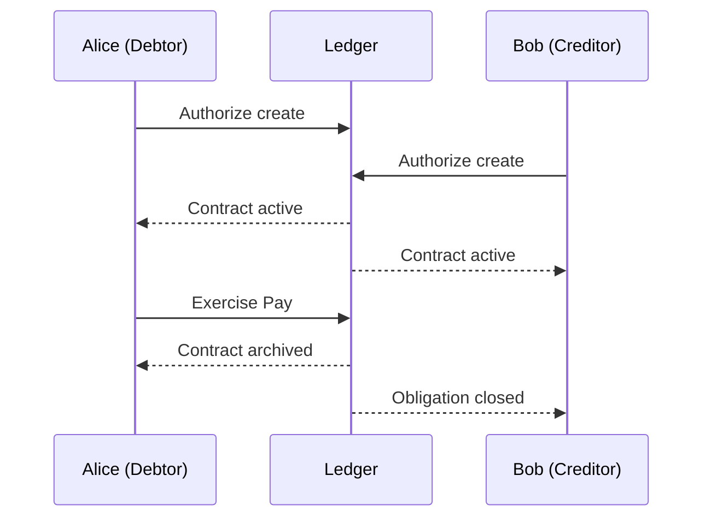

This walkthrough teaches the core Daml mental model by building a very small contract from scratch.

Before you begin, complete the environment setup in [Getting Started](/daml).

## What you will build

Imagine Alice owes Bob money. You want to record that obligation on a ledger. Before writing any code, ask yourself:

- **Who are the parties?** Alice (the debtor) and Bob (the creditor). In Daml, a `Party` represents a real actor in the system, like a person, company, or institution.
- **Who must authorize this contract to exist?** Should Bob alone be able to create a ledger record saying Alice owes him money, without Alice's approval? Clearly not. Both Alice and Bob must agree. These authorizing parties are called **signatories**.
- **Who can trigger payment?** Alice, the debtor. The party allowed to perform an action on a contract is called the **controller**.

These three concepts (Party, signatory, controller) are the foundation of every Daml contract. Here is what the full interaction looks like:



You will now turn these concepts into code.

## Create a project

```bash
dpm new payment-obligation --template skeleton
cd payment-obligation
```

This gives you a project with a `daml/Main.daml` file. Open it and replace the contents as you follow along.

## The module declaration

```daml
module Main where
```

Every `.daml` file starts with a **module declaration**, similar to a Go package or a JavaScript module. The module name must match the file name (`Main.daml` maps to `module Main`).

## Define the template

```daml
template PaymentObligation
  with
    debtor : Party
    creditor : Party
    amount : Decimal
  where
```

A **template** is the blueprint for a contract. Think of it like a class in Python or a struct in Go. Each contract created from this template will have its own `debtor`, `creditor`, and `amount`.

| Field      | Type      | Purpose                        |
| ---------- | --------- | ------------------------------ |
| `debtor`   | `Party`   | Alice, the party who owes      |
| `creditor` | `Party`   | Bob, the party who is owed     |
| `amount`   | `Decimal` | How much is owed               |

`Party` is a built-in Daml type that represents an identity on the ledger. `Decimal` is a fixed-precision number suitable for financial amounts.

## Signatories

```daml
    signatory debtor, creditor
```

A **signatory** is a party that must authorize the creation of a contract. By listing both `debtor` and `creditor`, we encode the rule we established earlier: a contract should only exist if the parties affected by it agree to it.

Back to our example: Bob cannot create a record saying "Alice owes me $100" without Alice's consent. Both signatures are required.

## The Pay choice

```daml
    nonconsuming choice Pay : ()
      controller debtor
      do
        archive self
```

A **choice** is an action that can be performed on an active contract. Let's break down each part:

- **`nonconsuming choice Pay : ()`** declares a choice named `Pay` that returns nothing (`()`). The `nonconsuming` keyword means the choice does not automatically archive the contract when exercised.
- **`controller debtor`** means only Alice (the debtor) can trigger this choice. The **controller** is the party allowed to exercise a choice, and the ledger enforces this, not just a code convention.
- **`archive self`** explicitly removes this contract from the active ledger.

### Why `nonconsuming` + `archive self`?

By default, Daml choices are consuming: they archive the contract automatically. Here we use `nonconsuming` and then explicitly `archive self` in the body so the contract lifecycle is visible in code. This makes it clear to readers that exercising `Pay` ends the obligation.

## Full contract code

Here is the complete `daml/Main.daml`. Copy this into your project:

```daml
module Main where

template PaymentObligation
  with
    debtor : Party
    creditor : Party
    amount : Decimal
  where
    signatory debtor, creditor

    nonconsuming choice Pay : ()
      controller debtor
      do
        archive self
```

## Build your project

Verify the contract compiles:

```bash
dpm build
```

If you see no errors, your template is valid and ready for testing.

## Why this model matters

The three concepts you just learned (`signatory`, `controller`, and `archive`) map directly to the questions we started with:

- **`signatory`** answers "who must authorize this contract to exist?"
- **`controller`** answers "who can perform each action?"
- **`archive self`** answers "what happens when the obligation is fulfilled?"

## Next step

Now that you have a working contract, learn how to verify it behaves correctly in [Testing your first Daml smart contract](/daml/testing-your-first-daml-smart-contract).
